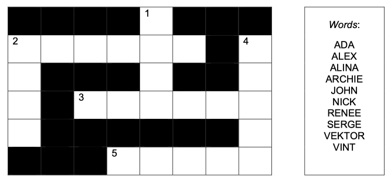
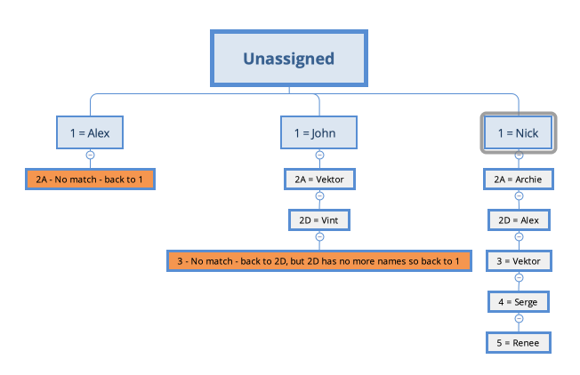

# CSP Question 2020

1) Binary Constraints
2) Domain consistency
3) Arc consistency
4) Backtracking search given the variable order of 1D, 2A, 2D, 3D, 4A, 5A and following the given word ordering

# 0. Solve the Puzzle
Solve the puzzle manually using whatever heuristics that works for you (placing the longest words first, most intersecting, etc.).
It shouldn't take more than 30 seconds, and it will provide feedback and intuition for the other questions.

### 1. Binary Constraints
Make sure you don't miss intersecting first letters, last letters, etc. by highlighting/shading the intersections.

Number the constraints - it will be useful for Arch Consistency.

    
    C1: 1[1] = 2[4]
    C2: 1[3] = 3[2]
    C3: 2A[0] = 2D[0]
    C4: 3[5] = 4[2]
    C5: 4[4] = 5[4]

### 2. Domain Consistency
Apply the word lengths:

    1: Alex, John, Nick, Vint
    2A: Archie, Vektor
    2D: Alex, John, Nick, Vint
    3: Archie, Vektor
    4: Alina, Renee, Serge
    5: Alina, Renee, Serge

### 3. Arc Consistency:
If you are not asked to show the workings, don't waste time implementing the algo from the programing assignment.
1) Go through the constraints one by one and find the words matching the constraints from both domains.
These can be pairs, such as John/Vektor and Nick/Archie in C1.

2) Don't forget to apply the constraints respectively - e.g. C1 gives 2 pairs, but C2 restricts this to only a single pair.

        C1: John/Vektor, Nick/Archie
        C2: Vektor / Nick -> 1: Nick, 2A: Archie, 3: Vektor
        C3: 2D: Alex
        C4: 4: Serge
        C5: Renee or Serge

### 3. Backtracking
For a much better backtracking example see the CSP question from 2021.
There's no replacement for manually doing several examples!

Backtracking is a Depth First Search (DFS) with each variable representing a depth level - see the image at the bottom.

Start by assigning the first word to the first variable !!! follow the ordering of both!!!.
Then put the first __unassigned__ word to the 2nd variable.

Check all the intersections and if still satisfied, continue with the next variable.

If the constraints are not met, backtrack to the previous variable (i.e. 1 level up) and choose the next available word.

If no words are available for that variable, backtrack to the higher level and assign a new value there.

    1 = Alex
    2A - no match back to 1
    
    1 = John
    2A = Vektor
    2D = Vint
    3 - no match back to 1
    
    1 = Nick
    2A = Archie
    2D = Alex
    3 = Vektor
    4 = Serge
    5 = Renee

#### CSP as Depth First Search

