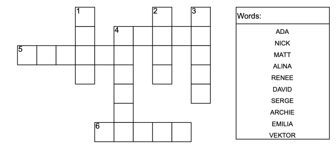
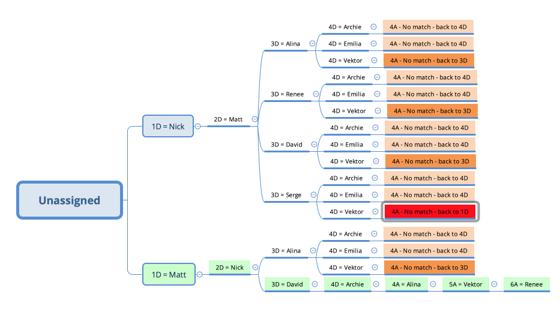

# CSP Question 2021

1) Binary Constraints
2) Domain consistency
3) Arc consistency
4) Backtracking search given the variable order of 1D, 2D, 3D, 4D, 4A, 5A, 6A and following the given word ordering

# 0. Solve the Puzzle
Solve the puzzle manually using whatever heuristics that works for you (placing the longest words first, most intersecting, etc.).
It shouldn't take more than 30 seconds, and it will provide feedback and intuition for the other questions.

### 1. Binary Constraints
Make sure you don't miss intersecting first letters, last letters, etc. by highlighting/shading the intersections.

Number the constraints - it will be useful for Arch Consistency.

    C1: 1D[2] == 5A[3]
    C2: 2D[1] == 4A[2]
    C3: 3D[1] == 4A[4]
    C4: 4D[0] == 4A[0]
    C5: 4D[1] == 5A[5]
    C6: 4D[5] == 6A[1]

### 2. Domain Consistency
Apply the word lengths:

    1D: Nick, Matt
    2D: Nick, Matt
    3D: Alina, Renee, David, Serge
    4D: Archie, Emilia, Vektor
    4A: Alina, Renee, David, Serge
    5A: Archie, Emilia, Vektor
    6A: Alina, Renee, David, Serge

### 3. Arc Consistency:
If you are not asked to show the workings, don't waste time implementing the algo from the programing assignment.
1) Go through the constraints one by one and find the words matching the constraints from both domains.
These can be pairs, such as Renee/Serge and David/Alina in C3.

2) Don't forget to apply the constraints respectively - e.g. C3 gives 3 pairs, but C4 restricts this to only a single pair.

        C1: 1: Matt / 5: Vektor
        C2: 2: Nick / 4: Alina
        C3: 3: xRenee/Serge, David 4A: xRenee/Serge, Alina
        C4: 4D: Archie, 4A: Alina
        C5: 5A:Vektor
        C6: 6: Renee/Serge

        1: Matt, 2: Nick, 3: David, 4A: Alina, 4D: Archie, 5: Vektor, 6: Renee/Serge

### 3. Backtracking
There's no replacement for manually doing several examples!

Backtracking is a Depth First Search (DFS) with each variable representing a depth level - see the image at the bottom.

Start by assigning the first word to the first variable !!! follow the ordering of both!!!.
Then put the first __unassigned__ word to the 2nd variable.

Check all the intersections and if still satisfied, continue with the next variable.

If the constraints are not met, backtrack to the previous variable (i.e. 1 level up) and choose the next available word.

If no words are available for that variable, backtrack to the higher level and assign a new value there.

This example is especially cruel because you know there is a simple solution (the green branch below), but you have to hit all the wrong branches first...

    1D = Nick
    2D = Matt
    3D = Alina
    4D = Archie
    4A - no match - backtrack to 4D
        4D = Emilia
        4A - no match - backtrack to 4D
            4D = Vektor
            4A = no match - back to 3D
            
    3D = Renee
    4D = Archie
    4A = no match - back to 4D
        4D = Emilia
        4A - no match - back to 4D
            4D = Vektor
            4A - no match - back to 3D
            
    3D = David
    4D = Archie
    4A - no match back to 4D
        4D = Emilia
        4A - no match - back to 4D
            4D = Vektor
            4A - no match - back to 3D
            
    3D = Serge
    4D = Archie
    4A - no match back to 4D
        4D = Emilia
        4A - no match - back to 4D
            4D = Vektor
            4A - no match - back to 1D
    
    1D = Matt
    2D = Nick
    3D = Alina
    4D = Archie
    4A - no match - back to 4D
        4D = Emilia
        4A - no match - back to 4D
            4D = Vektor
            4A - no match - back to 3D
            
    3D = Renee
    4D = Archie
    4A - no match - back to 4D
        4D = Emilia
        4A - no match - back to 4D
            4D = Vektor
            4A - no match - back to 3D
    
    3D = David
    4D = Archie
    4A = Alina
    5A = Vektor
    6A = Renee 

#### CSP as Depth First Search

